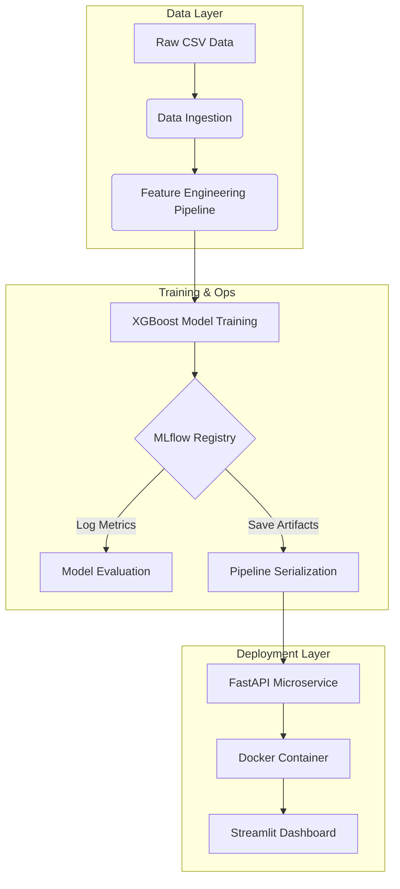

# ⚡ RetainIQ: The Autonomous Churn Defense Engine
### *Predict. Intervene. Retain.*

[](https://python.org)
[](https://xgboost.readthedocs.io/)
[](https://fastapi.tiangolo.com/)
[](https://streamlit.io/)
[](https://www.docker.com/)
[](https://mlflow.org/)

---

## 🚀 Executive Summary

**RetainIQ** is not just a predictive model; it is an **end-to-end Customer Retention Intelligence System**. Built to tackle the billion-dollar problem of customer churn in the telecom sector, RetainIQ moves beyond simple prediction to actionable intervention.

It combines state-of-the-art **Gradient Boosting (XGBoost)** for risk scoring, **Uplift Modeling** to identify "persuadable" customers, and a microservice architecture for real-time deployment. From raw data ingestion to a sleek Streamlit dashboard, RetainIQ demonstrates the full lifecycle of a modern Machine Learning product.

---

## 🔮 The Tech Stack

### **Machine Learning Core**
*   **XGBoost:** The engine driving our high-performance classification model (ROC AUC ~0.82).
*   **Scikit-Learn:** For robust feature engineering pipelines (`ColumnTransformer`, `OneHotEncoder`).
*   **Uplift Modeling:** A sophisticated dual-model approach to calculate the incremental impact of retention offers.

### **MLOps & Engineering**
*   **MLflow:** For tracking experiments, logging metrics (Brier Score, PR AUC), and versioning artifacts.
*   **FastAPI:** Exposes the model as a high-concurrency REST API for real-time inference.
*   **Docker:** Containerizes the entire prediction service for "build once, run anywhere" deployment.
*   **GitHub Actions:** CI/CD pipeline ensuring code quality and automated testing.

### **Visualization & Interface**
*   **Streamlit:** Provides an interactive, user-friendly frontend for non-technical stakeholders to test predictions.
*   **Matplotlib / Seaborn:** Used for deep-dive exploratory data analysis and A/B test simulation visualizations.

---

## 🧠 System Architecture



---

## 📊 Key Insights & Performance

### 1. Model Precision
Our XGBoost classifier achieves an **ROC AUC of 0.82**, enabling highly accurate identification of at-risk customers.

### 2. Uplift Intelligence
By simulating an A/B test, our **Uplift Model** identified that targeting the top 20% of "persuadable" customers yields nearly **3x the retention impact** compared to random targeting, while saving budget on "lost causes."

### 3. A/B Testing Strategy
We designed a rigorous statistical test requiring **1,565 samples per arm** to detect a 5% reduction in churn with 80% power, ensuring data-driven decision-making.

---

## ⚡ Quick Start Guide

### 1. Clone the Repository
```bash
git clone https://github.com/SalmaTech-03/RetainIQ.git
cd RetainIQ
```

### 2. Launch the API with Docker
```bash
docker build -t retainiq-api .
docker run -p 8001:8001 retainiq-api
```
*The API is now live at `http://localhost:8001`*

### 3. Run the Dashboard
In a new terminal:
```bash
streamlit run src/streamlit_app.py
```

---

## 📂 Project Structure

```text
RetainIQ/
├── .github/workflows/   # CI/CD Pipelines
├── data/                # Raw & Processed Data
├── docs/                # A/B Test Plans & Guides
├── mlruns/              # MLflow Experiment Logs
├── models/              # Serialized Models (.joblib)
├── notebooks/           # Jupyter Labs (EDA, Uplift)
├── src/                 # Source Code
│   ├── app.py           # FastAPI Application
│   ├── features.py      # Engineering Pipelines
│   ├── train.py         # Training Script
│   └── streamlit_app.py # UI Dashboard
├── Dockerfile           # Container Config
└── requirements.txt     # Dependencies
```

---

## 📸 Visuals

### *The Dashboard*
An interactive interface allowing CRM managers to input customer data and receive instant risk bands ("High", "Medium", "Low") and churn probabilities.

### *Uplift by Decile*
A critical visualization demonstrating the ROI of the model: determining exactly *who* to target to maximize retention.

---

<p align="center">
  <sub>Built with 💙 by SalmaTech-03.</sub>
</p>
