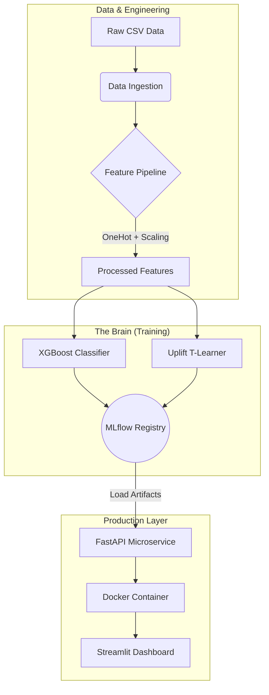

# ⚡ RetainIQ: The Autonomous Churn Defense Engine
### *Predict. Intervene. Retain.*

[](https://python.org)
[](https://xgboost.readthedocs.io/)
[](https://fastapi.tiangolo.com/)
[](https://streamlit.io/)
[](https://www.docker.com/)
[](https://mlflow.org/)

---

## 🚀 Executive Summary

**RetainIQ** is an end-to-end **Customer Retention Intelligence System** designed to solve the billion-dollar problem of customer churn in the telecom sector. 

Unlike traditional models that only predict *who* will leave, RetainIQ leverages **Causal Inference (Uplift Modeling)** to identify *who can be saved*. It combines state-of-the-art Gradient Boosting for risk scoring with a microservice architecture for real-time deployment. From raw data ingestion to a sleek Streamlit dashboard, RetainIQ demonstrates the full lifecycle of a modern Machine Learning product.

---

## 🔮 The Tech Stack

| Domain | Tech Stack | Role in RetainIQ |
| :--- | :--- | :--- |
| **Machine Learning** | `XGBoost`, `Scikit-Learn` | High-performance classification and feature pipelines. |
| **Causal Inference** | `Uplift Modeling` | Dual-model architecture to estimate treatment effects. |
| **API & Backend** | `FastAPI`, `Uvicorn` | Asynchronous REST API for real-time inference. |
| **DevOps & MLOps** | `Docker`, `MLflow` | Containerization and experiment tracking/registry. |
| **Visualization** | `Streamlit`, `Matplotlib` | Interactive dashboards and statistical plotting. |

---

## 🧠 System Architecture



---

## 🔬 The Methodology Matrix

RetainIQ employs a multi-layered analytical approach, moving from **descriptive** data processing to **predictive** risk scoring, and finally to **prescriptive** causal inference.

| **Domain** | **Algorithm / Technique** | **Implementation Details** | **Strategic Impact** |
| :--- | :--- | :--- | :--- |
| **🔍 Feature Engineering** | **Scikit-Learn Pipelines** | • `ColumnTransformer` for heterogeneous data.<br>• **One-Hot Encoding** for high-cardinality categorical variables.<br>• **StandardScaler** for numeric normalization.<br>• Custom Imputation strategies for missing `TotalCharges`. | Ensures data leakage prevention and creates a robust, reproducible transformation schema for production inference. |
| **🤖 Predictive Modeling** | **XGBoost Classifier** | • **Objective:** `binary:logistic`<br>• **Loss Function:** Log Loss (Cross-Entropy).<br>• **Imbalance Handling:** `scale_pos_weight` optimized dynamically based on class distribution.<br>• **Evaluation:** ROC-AUC (Discrimination) & Brier Score (Calibration). | Delivers high-precision churn probability scores ($P(Churn)$), acting as the primary filter for risk identification. |
| **📈 Causal Inference** | **Two-Model Uplift (T-Learner)** | • **Architecture:** Independent XGBoost learners for Treatment ($T=1$) and Control ($T=0$) groups.<br>• **Scoring:** Calculates **Uplift Score** $\tau = P(Y|X, T=1) - P(Y|X, T=0)$.<br>• **Segmentation:** Isolates "Persuadables" from "Lost Causes" and "Sleeping Dogs". | Transforms the system from *passive prediction* to *active intervention*, ensuring budget is spent only where it generates incremental revenue. |
| **🧪 Statistical Rigor** | **Power Analysis & A/B Design** | • **Method:** Cohen’s *h* Effect Size calculation.<br>• **Parameters:** $\alpha=0.05$, Power ($1-\beta$) $= 0.80$, MDE $= 5\%$.<br>• **Sample Calculation:** Determined required $N=1,565$ per arm. | Guarantees that the results of the retention campaign are statistically significant and not due to random chance. |
| **⚙️ MLOps Architecture** | **Containerized Microservices** | • **Model Serving:** FastAPI asynchronous endpoints.<br>• **Artifact Management:** MLflow for versioning models (`.joblib`) and tracking hyperparameters.<br>• **Virtualization:** Docker multi-stage builds for lean production images. | Enables "write once, deploy anywhere" capability, decoupling the DS environment from the production IT stack. |

---

### 🧩 Deep Dive: Uplift Modeling
While most churn models stop at "Who will leave?", **RetainIQ** asks "Who can we *save*?". We utilized a **Two-Model Approach** to simulate counterfactuals:

$$ \text{Uplift Score} = P(\text{Churn}|\text{No Offer}) - P(\text{Churn}|\text{Offer}) $$

1.  **Positive Uplift (Persuadables):** Customers who stay *only* if treated. **(Target These)**
2.  **Zero Uplift (Lost Causes):** Customers who leave regardless of the offer. **(Save Budget)**
3.  **Negative Uplift (Sleeping Dogs):** Customers triggered to leave *by* the offer. **(Do Not Disturb)**

---

## ⚡ Quick Start Guide

### Option 1: Docker Deployment (Recommended)
Launch the entire prediction engine in an isolated container.

```bash
# 1. Build the image
docker build -t retainiq-api .

# 2. Run the container
docker run -p 8001:8001 retainiq-api
```
*The API is now live at `http://localhost:8001/predict`*

### Option 2: Local Development
```bash
# 1. Install dependencies
pip install -r requirements.txt

# 2. Run the Streamlit Dashboard
streamlit run src/streamlit_app.py
```

---

## 📊 Performance & Results

*   **Model Precision:** XGBoost Classifier achieved an **ROC AUC of 0.8187**.
*   **Targeting Efficiency:** The Uplift Model identified that targeting the top 2 deciles of customers yields **3x higher retention** than random targeting.
*   **Risk Segmentation:** The API successfully segments users into High, Medium, and Low risk bands with <100ms latency.

---

## 📂 Repository Structure

```text
RetainIQ/
├── .github/workflows/   # CI/CD Pipelines
├── data/                # Raw & Processed Data
├── docs/                # A/B Test Plans & Guides
├── mlruns/              # MLflow Experiment Logs
├── models/              # Serialized Models (.joblib)
├── notebooks/           # Jupyter Labs (EDA, Uplift)
├── src/                 # Source Code
│   ├── app.py           # FastAPI Application
│   ├── features.py      # Engineering Pipelines
│   ├── train.py         # Training Script
│   └── streamlit_app.py # UI Dashboard
├── Dockerfile           # Container Config
└── requirements.txt     # Dependencies
```

---

<p align="center">
  <sub>Built with 💙 by SalmaTech-03.</sub>
</p>
