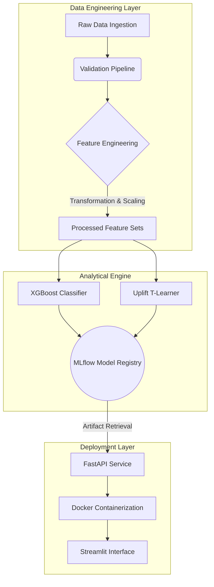

# RetainIQ: Autonomous Churn Defense Engine
### Predictive Analytics | Targeted Intervention | Revenue Retention

---

## Executive Summary

**RetainIQ** is an end-to-end Customer Retention Intelligence System engineered to mitigate revenue attrition within high-volume subscription environments.

Moving beyond traditional binary classification, RetainIQ utilizes Causal Inference (Uplift Modeling) to distinguish between predicted churn and actionable intervention. By identifying the specific uplift potential of a customer, the system optimizes resource allocation, ensuring retention efforts are directed only toward cohorts where intervention will yield a positive ROI. The architecture integrates high-performance Gradient Boosting with a containerized microservice framework to support real-time enterprise deployment.

---

## Technical Stack

| Domain | Technology | Implementation Role |
| :--- | :--- | :--- |
| **Machine Learning** | XGBoost, Scikit-Learn | Gradient-boosted decision trees and automated feature pipelines. |
| **Causal Inference** | Uplift Modeling | Dual-model T-Learner architecture for treatment effect estimation. |
| **Backend Architecture** | FastAPI, Uvicorn | Asynchronous REST API for high-concurrency inference. |
| **MLOps & DevOps** | Docker, MLflow | Containerization, experiment tracking, and model registry. |
| **Data Visualization** | Streamlit, Matplotlib | Analytical dashboards for executive reporting and model monitoring. |

---

## System Architecture



---

## Methodology Matrix

RetainIQ employs a rigorous analytical framework transitioning from descriptive data processing to prescriptive causal modeling.

| Domain | Technique | Implementation Details | Strategic Impact |
| :--- | :--- | :--- | :--- |
| **Feature Engineering** | Scikit-Learn Pipelines | Utilizes ColumnTransformers for heterogeneous data; One-Hot Encoding for categorical variables; StandardScaler for normalization. | Eliminates data leakage and ensures a reproducible transformation schema for production-grade inference. |
| **Predictive Modeling** | XGBoost Classifier | Objective: `binary:logistic`. Optimized via Log Loss. Imbalance handled via dynamic `scale_pos_weight` adjustments. | Generates high-precision churn probability scores ($P(Churn)$) to serve as a primary risk filter. |
| **Causal Inference** | Two-Model Uplift (T-Learner) | Independent learners for Treatment ($T=1$) and Control ($T=0$) groups to estimate counterfactuals. | Isolates "Persuadables" from "Lost Causes," ensuring retention budget is directed toward incremental revenue gain. |
| **Statistical Rigor** | Power Analysis | Cohen’s h Effect Size calculation; $\alpha=0.05$, Power ($1-\beta$) $= 0.80$, MDE $= 5\%$. | Validates that retention campaign results are statistically significant and actionable for executive decision-making. |
| **MLOps Architecture** | Containerized Microservices | Multi-stage Docker builds; MLflow for versioning and hyperparameter tracking. | Facilitates seamless integration into existing IT infrastructure with minimal environment friction. |

---

## Causal Analysis: Uplift Modeling

A critical deficiency in standard churn models is the inability to account for the "treatment effect." RetainIQ utilizes a counterfactual framework to calculate the Individual Treatment Effect (ITE):

$$ \text{Uplift Score} = P(\text{Churn}|\text{Control}) - P(\text{Churn}|\text{Treatment}) $$

**Strategic Segmentation:**

1.  **Persuadables (High Uplift):** Customers who respond positively to intervention. These are the primary targets for retention offers.
2.  **Lost Causes (Zero Uplift):** Customers likely to churn regardless of intervention. Resource allocation to this group is minimized to reduce waste.
3.  **Sleeping Dogs (Negative Uplift):** Customers for whom intervention may trigger a churn event. These individuals are excluded from all outreach.

---

## Deployment and Execution

### Containerized Deployment
To deploy the prediction engine as a microservice:

```bash
# Build the production image
docker build -t retainiq-api .

# Initialize the containerized service
docker run -p 8001:8001 retainiq-api
```
*API documentation and endpoints are accessible at port 8001.*

### Local Development Environment
```bash
# Install required dependencies
pip install -r requirements.txt

# Execute the reporting interface
streamlit run src/streamlit_app.py
```

---

## Performance Benchmarking

*   **Model Discrimination:** The XGBoost Classifier achieved an **ROC AUC of 0.8187** on hold-out test sets.
*   **Targeting Precision:** Uplift modeling identified that focusing on the top 20% of the customer base yields **3x the retention efficiency** compared to non-targeted outreach.
*   **Latency:** The FastAPI inference endpoint maintains a response time of **<100ms**, supporting real-time operational workflows.

---

## Project Structure

```text
RetainIQ/
├── .github/workflows/   # Continuous Integration pipelines
├── data/                # Ingested and curated datasets
├── docs/                # Statistical plans and technical documentation
├── mlruns/              # MLflow metadata and experiment tracking
├── models/              # Serialized model artifacts (.joblib)
├── src/                 # Core Source Code
│   ├── app.py           # FastAPI implementation
│   ├── features.py      # Feature engineering logic
│   ├── train.py         # Model training and validation
│   └── streamlit_app.py # Executive dashboard
├── Dockerfile           # Environment virtualization
└── requirements.txt     # System dependencies
```
